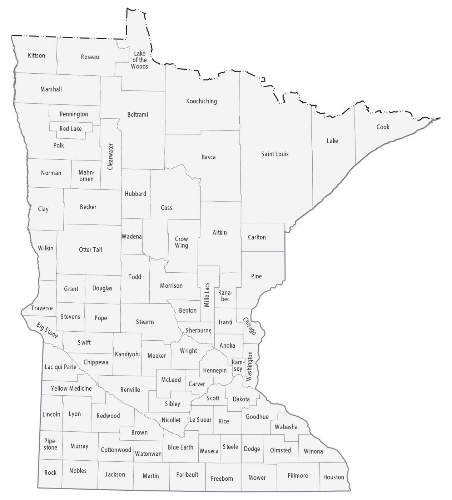

::: {.columns}

::: {.column width="55%"}

Our project examines how land ownership in Minnesota has changed over time using parcel-level data from the Minnesota Geospatial Information Office (MnGeo).We analyze variables such as parcel size, owner, land type, assessed value, and property taxes to understand patterns in ownership transfers, land use, and differences between private and public ownership. 

**Research Question:** How has the rate of land ownership transfers in Minnesota changed over time?

Data Source: [Minnesota Geospatial Information Office](https://www.mngeo.state.mn.us/chouse/land_own_property.html)

:::

::: {.column width="45%" .v-center}

{width="100%"}

:::

:::
